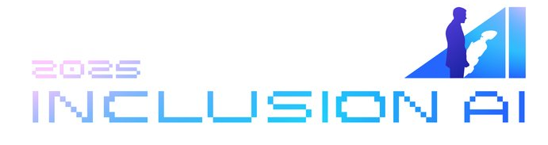

## Hi there 👋

Welcome to the official Github organization homepage for inclusionAI.

This organization contains the series of open-source projects from Ant Group with dedicated efforts to work towards Artificial General Intelligence (AGI).

In here you can find Large Language Models (LLM), Reinforcement Learning (RL) or other systems related to model training and inference, and other AGI-related frameworks or applications.

### Get Involved

Our work is guided by the principles of fairness, transparency, and collaboration, and we are dedicated to creating models that reflect the diversity of the world we live in.
Whether you're a researcher, developer, or simply someone passionate about AI, we invite you to join us in our mission to create AI that benefits everyone.

- **Explore Our Models**: Check out our latest models and datasets on the inclusionAI Hub.
- **Contribute**: Interested in contributing? Visit our [GitHub](https://github.com/inclusionAI) repository to get started.
- **Join the Conversation**: Connect with us on [Twitter](https://x.com/ant_oss) and [Discord](https://discord.gg/2X4zBSz9c6) to stay updated on our latest projects and initiatives.
